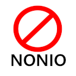

 

 

# fucknonio

This is a Chrome extension to block out Nonio popups.

# How to use

To use this, open [chrome://extensions/](chrome://extensions/) on Google Chrome, on the top rigth corner enable _developer mode_ then click the _Load Unpacked_ button and select the the _fucknonio_ folder. 